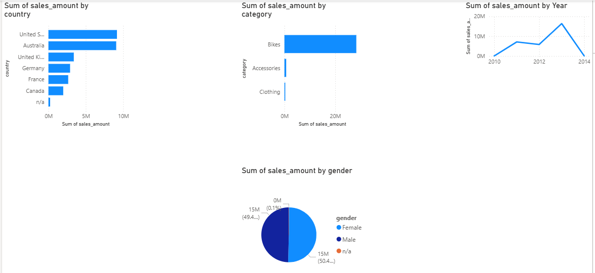

# SQL Data Warehouse Project

An end-to-end data engineering project that builds a SQL Server data warehouse from raw source data to an analytics-ready star schema, connected to a Power BI dashboard.

---

## Overview

Two source systems, CRM and ERP, provide raw CSV data across 6 source tables and over 115,000 raw records. The data is ingested, cleaned, and transformed into a structured data model. The final fact table contains 79,177 sales transactions spanning from 2010 to 2014, linked to 18,484 unique customers across 6 countries and 295 active products across 3 categories.

---

## Data Model

The warehouse is built around a star schema with three views:

- Customer dimension — demographics, country, gender, marital status
- Product dimension — category, subcategory, cost, product line
- Sales fact table — 79,000+ transactions linked to customers and products

---

## Dashboard

---

## Tech Stack

- SQL Server Express
- SSMS
- Power BI Desktop

---

## How to Run

1. Create a DataWarehouse database in SQL Server
2. Run the SQL scripts in order
3. Update the CSV file paths to match your local setup
4. Connect Power BI to your SQL Server and load the views
